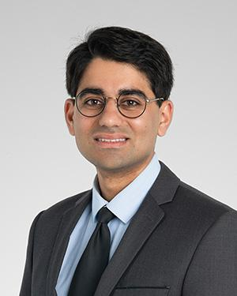

## WELCOME TO THE TABULA RASA LAB!



  
 Tabula Rasa lab develops, validates, and implements biomarkers for neuro-oncologic and neuro-genetic diseases. These biomarkers are critical to improving the care for patients with neurological diseases such as glioblastoma, which lack cures or treatments that are effective in the long-term. By developing biomarkers for neurologic diseases, we hope to diagnose these conditions earlier, estimate prognosis more accurately, identify when treatments are and are not working, and improve how clinical trials are run. Neurologists use signs and symptoms and the clinical history reported by the patient or caregiver to infer the disease process, its etiology, disease progression, and its response to treatment. Biomarkers quantify these changes and can help to identify specific disease subtypes, such as those that are more likely to respond to a particular treatment. Our lab uses applied mathematics, computer science, data science, genomics, wet lab biology, and patient registry studies to identify and test biomarkers. We aim to improve patient quantity and quality of life using biomarker-driven neurology.
  



  {{ text }}

## PRINCIPAL INVESTIGATOR

  

    
  

  

    
A mathematician and computer scientist turned neuro-oncologist, Dr. Dhawan uses his background in data science to more accurately diagnose, treat and prognosticate neurological diseases. He holds appointments in Cleveland Clinic’s Lerner Research Institute and Taussig Cancer Center, where he is assistant staff in the Rose Ella Burkhardt Brain Tumor and Neuro-Oncology Center. Dr. Dhawan’s research approach is interdisciplinary, having learned from experts in cancer biology, non-coding RNA biology, and evolutionary biology, alongside bioinformatics, data science, and applied mathematics. He has established the first suite of statistical metrics in a simple computational tool (sigQC) for the systematic evaluation of gene signature quality, now used by researchers worldwide for translational science. Dr. Dhawan collaborates with multiple researchers and physicians at Cleveland Clinic and other institutions on ongoing research projects for diseases including glioblastoma, glioma, meningioma, PTEN hamartoma tumor syndrome, tuberous sclerosis complex and leptomeningeal carcinomatosis.

  

